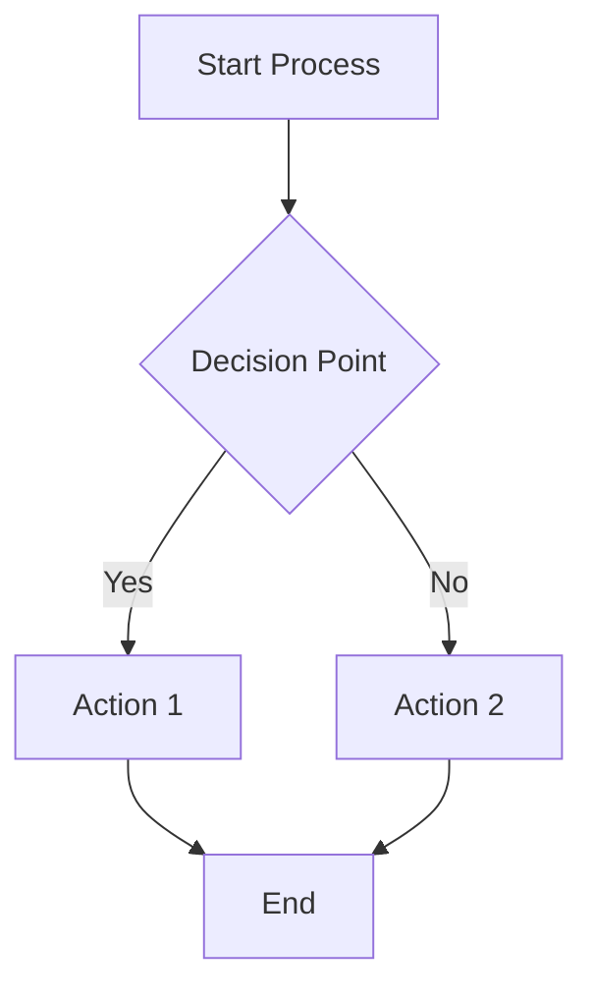

# PDF Visual Segmentation Pipeline - Technical Documentation

## Overview

This pipeline extracts, classifies, and analyzes visual elements (figures, charts, diagrams, images) from textbook PDFs for knowledge graph construction and RAG (Retrieval-Augmented Generation) applications. The system combines multiple detection strategies, PaddleOCR, computer vision, and **Mistral Vision API** to create comprehensive visual segment metadata with type-specific rich data extraction.

**Key Update**: Migrated from OpenAI GPT-4o-mini to **Mistral Pixtral-12B** vision model for all LLM-based analysis, providing cost-effective, high-quality visual understanding.

---

## Core Architecture

### 1. Data Models

#### **VisualType (Enum)**
Classifies visual elements into 5 distinct categories:
- `CHART` - Data visualizations with numerical axes (line, bar, scatter, pie, histogram, candlestick)
- `DIAGRAM` - Process flows, concept maps with nodes and connections (no numerical axes)
- `FLOWCHART` - Sequential decision flows with flowchart shapes
- `IMAGE` - Photos, screenshots, illustrations, scanned pages, embedded tables
- `FIGURE` - Generic/composite labeled figures (fallback category)

#### **Type-Specific Data Models**

**ChartSpecificData**
Enhanced metadata for charts/graphs:
- `chart_subtype` - line, bar, scatter, pie, histogram, candlestick, yield_curve
- `axes_info` - X/Y axis labels and metadata
- `value_ranges` - Min/max values with multiplier handling ($1.5M, 23K)
- `legend_items` - Detected legend entries
- `series_count` - Number of data series
- `grid_detected` - Presence of grid lines
- `color_scheme` - Dominant colors (hex codes)
- `estimated_data_points` - Data point count estimation
- `tick_labels` - X/Y axis tick values

**DiagramSpecificData**
Enhanced metadata for diagrams/flowcharts:
- `diagram_subtype` - process_flow, decision_tree, hierarchy, cycle, causal, system
- `node_count` - Number of nodes/components
- `nodes` - Node data (id, text, bbox)
- `connections` - Connection data (arrows, flows)
- `arrow_count` - Number of detected arrows
- `hierarchy_detected` - Hierarchical structure presence
- `layout_type` - hierarchical_vertical, hierarchical_horizontal, circular, free_form
- `shapes_detected` - Rectangle, circle, diamond counts
- `has_decision_points` - Decision node detection

**ImageSpecificData** (MAJOR UPDATE)
Enhanced metadata for images with **detailed content extraction**:
- `image_subtype` - screenshot, photo, illustration, scanned_page, embedded_table
- `contains_text` - Text presence indicator
- `text_density` - none, sparse, moderate, dense
- `is_embedded_table` - Table detection
- `dominant_colors` - Color palette (hex codes)
- `estimated_content_type` - interface, document, scene, object, mixed

**NEW CRITICAL FIELDS** for granular content extraction:
- `definitions` - Array of `{term, definition}` pairs extracted from visible definition boxes
- `formulas` - Array of `{formula, description, location}` for mathematical expressions
- `variables` - Array of `{variable, meaning}` for variable definitions
- `tables` - Array of `{description, rows, columns, headers, content_summary}` for embedded tables

**FigureSpecificData**
Metadata for composite figures:
- `is_composite` - Contains sub-figures (a), (b), (c)
- `sub_figure_count` - Number of sub-figures
- `contains_chart/diagram/image` - Content type flags

#### **MermaidRepresentation** (NEW)
Structured diagram representation in Mermaid syntax:
- `mermaid_code` - Complete Mermaid diagram code
- `diagram_type` - flowchart, graph, sequence
- `extraction_confidence` - Confidence score
- `extraction_notes` - Method and metadata

#### **BoundingBox**
Stores precise page coordinates:
- `x0, y0, x1, y1` - Rectangle coordinates
- `page_width, page_height` - Page dimensions for normalization
- `area()` - Calculates bounding box area

#### **OCRResult**
Structured OCR output with specialized fields:
- `raw_text` - Complete extracted text
- `blocks` - Individual text blocks with bounding boxes and confidence
- `confidence` - Average OCR confidence score (0-1)
- **Chart-specific**: `axis_labels`, `legend_items`, `tick_labels`
- **Diagram-specific**: `node_texts`, `detected_arrows`

#### **VisualSegment**
Complete metadata container for each visual element:
- **Identity**: `segment_id`, `segment_type`, `book_id`, `page_no`
- **Location**: `bbox` (bounding box coordinates)
- **Content**: `image_path`, `image_bytes`, `ocr_result`
- **Context**: `caption_text`, `figure_number`, `reference_keys`
- **Analysis**: `summary`, `classification_confidence`, `classification_method`
- **Type-Specific Rich Data**: `chart_data`, `diagram_data`, `image_data`, `figure_data`
- **Mermaid**: `mermaid_repr` (for diagrams/flowcharts)
- **Structured Text**: `extracted_text_structured` (labels, values, annotations)
- **Concept Linking**: `linked_concept_ids`
- **Relationships**: `heading_path`, `linked_segment_ids`, `nearby_text`

---

## Mistral Vision API Integration

### **MistralVisionAPI Class**

Handles all interactions with Mistral's Pixtral-12B vision model.

**Key Features**:
1. **Single Comprehensive API Call** - Classification, metadata extraction, and summary generation in one request
2. **Type-Specific Prompting** - Custom prompts for charts, diagrams, flowcharts, images, and figures
3. **Structured Metadata Extraction** - JSON-formatted responses with validation
4. **Mermaid Diagram Extraction** - Converts diagrams/flowcharts to Mermaid syntax
5. **Robust Error Handling** - Fallback mechanisms when API unavailable

#### **Comprehensive Visual Analysis**

```python
analyze_visual_comprehensive(image: Image.Image, ocr_result: OCRResult) -> Dict
```

**Single API call performs**:
1. **Classification** - Categorizes into CHART, FLOWCHART, DIAGRAM, IMAGE, or FIGURE
2. **Metadata Extraction** - Type-specific rich data (axes, nodes, formulas, tables, etc.)
3. **Summary Generation** - 3-5 sentence educational description

**Prompt Engineering Highlights**:
- **Chart Detection**: Requires numerical axes with plotted data
- **Flowchart vs Diagram**: Distinguishes decision points from general relationships
- **Image Content Extraction**: Extracts definitions, formulas, variables, and tables with strict visibility rules
- **Confidence Calibration**: Returns calibrated scores (0-1)

**CRITICAL EXTRACTION RULES** (for IMAGE type):

**Definitions**:
- Only extract if explicitly visible (boxed definitions, callouts, glossary entries)
- DO NOT infer or create definitions
- Format: `{term: "exact term", definition: "exact text"}`
- Return `[]` if no definitions visible

**Formulas**:
- Only extract if mathematical expressions are visible (=, +, -, *, /, ^)
- Preserve exact notation (e.g., `PV = FV / (1+r)^n`, `=B2*C2/(1+D2)^E2`)
- Include location (cell reference or description)
- Return `[]` if no formulas visible

**Variables**:
- Only extract if variable meanings are shown ("where x = ...", legend, notation key)
- Must show BOTH symbol AND meaning
- Format: `{variable: "symbol", meaning: "meaning"}`
- Return `[]` if no variable definitions visible

**Tables**:
- Only extract if actual table structure is visible (grid with rows/columns)
- Count visible rows/columns
- Extract visible headers exactly as shown
- Describe table content based on what's visible
- Return `[]` if no table visible

**General Rule**: When in doubt, use EMPTY ARRAY `[]` rather than guessing. Only extract information that is LITERALLY VISIBLE.

#### **Mermaid Diagram Extraction**

```python
extract_mermaid_representation(image: Image.Image, segment: VisualSegment) -> MermaidRepresentation
```

Converts diagrams/flowcharts to Mermaid syntax for better LLM understanding and rendering.

**Process**:
1. Identifies all nodes/components with text labels
2. Detects connections/arrows and directions
3. Chooses appropriate Mermaid type (`graph TD`, `flowchart LR`, etc.)
4. Generates syntactically correct Mermaid code

**Example Output**:


---

## Extraction Pipeline

### Phase 1: Two-Pass Image Detection Strategy

**Smart two-pass approach with conflict resolution:**

#### **Pass 1: Caption-Based Detection (Primary - High Confidence)**

**Why caption-first?** Captions provide the most reliable signal for figure boundaries and are specifically formatted in academic texts.

**Process**:
1. **Caption Pattern Matching**
   - Searches for patterns: `Figure X`, `Fig. X`, `Chart X`, `Diagram X`, `Exhibit X`
   - Uses regex with flexible formatting: `Figure\s+(\d+(?:\.\d+)?)\s*[:\-]?\s*(.*?)(?=\n\n|\Z)`
   
2. **Caption Validation** (Critical for accuracy)
   - Verifies caption is at **beginning of text block** (not in-text reference)
   - Excludes blocks containing reference phrases: "as shown in", "see Figure", "in Figure"
   - Checks length constraint (captions typically < 400 chars)
   - Distinguishes captions from body paragraphs

3. **Visual Content Boundary Detection**
   - Searches upward from caption (typically 100-500 points)
   - Combines **multiple boundary signals**:

   **Signal 1: Drawing Commands (Most Reliable)**
   ```python
   # PyMuPDF drawing commands = vector graphics (charts, diagrams)
   drawings = page.get_drawings()
   # Groups nearby drawings into single figure
   ```

   **Signal 2: Embedded Images**
   ```python
   # Raster images (photos, scanned content)
   image_list = page.get_images(full=True)
   img_rects = page.get_image_rects(xref)
   ```

   **Signal 3: Whitespace Analysis**
   - Detects large vertical gaps (>30 points) between text blocks
   - Gaps indicate natural separation between body text and figure

   **Signal 4: Text Boundary Detection**
   - Identifies body paragraphs (wide, dense, left-aligned, >120 chars)
   - Distinguishes from figure labels (short, scattered, <50 chars)
   - Figure starts after last body paragraph

4. **Boundary Combination Logic**
   ```
   Priority: drawing_bounds > image_bounds > whitespace > text > fallback
   ```
   - Uses drawing bounds for charts/diagrams (most accurate)
   - Falls back to image bounds for photos
   - Uses whitespace/text analysis when vector data unavailable
   - Conservative fallback: 200 points above caption with padding

5. **Region Rendering**
   - Renders complete region (figure + caption) at 150 DPI
   - Captures vector graphics, text, and all content as single image
   - Saves as PNG with stable ID: `{book_id}_p{page}_md5hash.png`

#### **Pass 2: Embedded Image Extraction with Validation**

**Purpose:** Catch figures without detected captions (unlabeled diagrams, photos, etc.)

**Process**:
1. **Direct Image Extraction**
   ```python
   image_list = page.get_images(full=True)
   base_image = page.parent.extract_image(xref)
   ```

2. **Strict Validation** (reduces false positives)
   
   Validation scoring system (threshold: 0.5):
   
   - **Size validation** (+0.3 for area > 10,000 sq pts)
   - **Dimension check** (reject if < 50x50 pixels)
   - **Aspect ratio** (+0.2 if between 0.2-5.0)
   - **Position check** (-0.2 if in header/footer zone)
   - **Caption proximity** (+0.4 if caption found nearby)
   - **Content variance** (+0.2 if variance > 100, -0.3 if < 10)

3. **Caption Search**
   - Looks for captions within 60 points below image
   - If found, expands bbox to include caption
   - Re-renders combined region

4. **Conflict Resolution**
   
   When embedded image overlaps with caption-based segment (>40% overlap):
   
   **Decision factors**:
   - Caption presence (+3 points for caption-based)
   - Size comparison (larger = more context)
   - Photo detection (raster images favor embedded)
   - Vector content count (+2 for >10 drawing commands)
   - Validation score
   
   **Outcome**: Keeps highest-scoring version, discards duplicate

---

### Phase 2: OCR Processing with PaddleOCR

**OCRProcessor** extracts and structures text from images using **PaddleOCR 3.3.2**.

**Migration from Tesseract to PaddleOCR**:
- More accurate multi-language support
- Better handling of complex layouts
- Built-in text orientation detection
- Higher confidence scores

**Process**:

1. **PaddleOCR Execution**
   ```python
   ocr = PaddleOCR(use_textline_orientation=True, lang='en')
   result_generator = ocr.predict(img_array)
   ```
   - Returns detection polygons and recognized text
   - Confidence scores for each text block
   - Handles rotated and skewed text

2. **Text Block Extraction**
   - Converts polygon coordinates to `[x0, y0, x1, y1]` format
   - Filters by confidence threshold (scaled to 0-1 range)
   - Builds structured blocks with text and bounding boxes

3. **Chart-Specific Detection**
   - **Axis labels**: Pattern matching for "year", "time", "value", "price", "%"
   - **Legend items**: Spatial clustering (right side, vertical proximity)
   - **Tick labels**: Numeric sequences with multiplier handling ($1.5M, 23K)
   - **Value ranges**: Enhanced parsing for currency symbols and units

4. **Diagram-Specific Detection**
   - **Node texts**: Medium-length blocks (3-50 chars) = potential diagram nodes
   - **Arrow counting**: 
     ```python
     # Detects diagonal lines (20-70° or 110-160°) as arrows
     edges = cv2.Canny(img_array, 50, 150)
     lines = cv2.HoughLinesP(edges, ...)
     ```

5. **Advanced Features**
   - **Legend Detection**: Spatial clustering of right-aligned text
   - **Chart Subtype Detection**: Multi-signal approach (text patterns + visual features)
   - **Axes Extraction**: Spatial-aware (bottom zone = x-axis, left zone = y-axis)
   - **Grid Detection**: Morphological line detection
   - **Color Extraction**: K-means clustering on non-background pixels

---

### Phase 3: Visual Classification with Mistral API

**VisualClassifier** uses **Mistral Vision API** for intelligent classification.

**Classification Process**:

1. **Comprehensive Analysis**
   - Single API call to Mistral Pixtral-12B
   - Analyzes image with OCR context
   - Returns classification, confidence, and metadata

2. **Type-Specific Prompts**

   **For CHART**:
   - Requires numerical axes with data plotted
   - Extracts: subtype, axis labels, legend, value ranges, series count

   **For FLOWCHART**:
   - Requires decision points (diamonds) and sequential flow
   - Extracts: node count, decision points, flow direction

   **For DIAGRAM**:
   - Shows relationships but NO numerical axes
   - Extracts: subtype, node count, layout type, hierarchy

   **For IMAGE**:
   - Photographic/illustrative content including screenshots and tables
   - Extracts: subtype, text density, definitions, formulas, variables, tables

3. **Confidence Calibration**
   - Returns calibrated scores (0-1)
   - Higher confidence for clear visual indicators
   - Lower confidence for ambiguous cases

4. **Fallback Mechanism**
   - If API unavailable, returns safe defaults
   - Type: FIGURE, confidence: 0.3
   - Ensures pipeline continues even without API

**Chart Subtype Detection** (Enhanced):
- **Multi-signal approach**: Text patterns + visual features
- **Strict thresholds**: Prevents misclassification
- **Supported types**: line, bar, scatter, pie, histogram, candlestick
- **Debug logging**: Detailed scoring breakdown

---

### Phase 4: Summary Generation

**Two-tier approach:**

**Tier 1: Mistral API Summary** (Primary, included in comprehensive call)
- Uses Pixtral-12B vision model
- Type-specific prompts:
  - **Charts**: "What data is plotted? Key trends?"
  - **Diagrams**: "What process? Main components? Flow direction?"
  - **Images**: "Main subject? Key visual elements? Mention definitions/formulas/variables/tables if visible."
  - **General**: "Main subject? Key visual elements? Purpose?"
- Incorporates caption, figure number, OCR text as context
- 3-5 sentence concise output
- **CRITICAL**: Only mentions formulas/definitions/variables/tables if ACTUALLY VISIBLE

**Tier 2: Rule-Based Fallback** (0.5 confidence)
```python
if segment_type == CHART:
    summary = f"Chart displays {y_axis} versus {x_axis}"
elif segment_type == DIAGRAM:
    summary = f"Diagram with {node_count} components, {arrow_count} flows"
```

---

### Phase 5: Concept Linking (Enhanced)

**ConceptLinker** maps visuals to domain concepts using **multi-signal matching with TF-IDF and cosine similarity**.

**Research-backed approach:**

1. **Taxonomy Loading**
   ```python
   # Expected columns: Level, Concept, Tag(s), Rationale, Page(s)
   taxonomy_df = pd.read_excel(taxonomy_path)
   ```

2. **Index Building**
   - Normalizes concept names (lowercase, stripped)
   - Expands tags as context terms
   - Builds TF-IDF statistics across all concepts

3. **Multi-Signal Scoring** (Updated - 100 points total)

   **Signal 1: Exact Phrase Match** (0-30 points)
   - Detects exact concept name in text
   - Position-weighted (caption > summary > OCR)
   
   **Signal 2: Cosine Similarity** (0-30 points) - **NEW**
   - TF-IDF vectors for search context and concepts
   - Context-weighted (caption: 1.0, summary: 0.9, OCR: 0.7, nearby: 0.5)
   - Captures semantic similarity beyond exact matches
   
   **Signal 3: Weighted Term Overlap** (0-25 points)
   - Primary terms: weight 1.0, context terms: weight 0.5
   - IDF weighting for rare terms
   
   **Signal 4: Fuzzy Matching** (0-10 points)
   - Levenshtein distance for OCR errors, plurals, typos
   - Minimum 80% similarity threshold
   
   **Signal 5: Context Bonus** (0-5 points)
   - Caption mention: +50%, Summary: +30%, Nearby: +20%

4. **TF-IDF Implementation**
   ```python
   # TF = term frequency (context-weighted)
   # IDF = log((N + 1) / (df + 1)) + 1
   tfidf = tf * idf
   ```

5. **Cosine Similarity Calculation**
   ```python
   # cos(θ) = (A · B) / (||A|| × ||B||)
   # A = search context TF-IDF vector
   # B = concept TF-IDF vector
   cosine_sim = dot_product / (norm_A * norm_B)
   ```

6. **Deduplication & Ranking**
   - Removes duplicate concept_ids
   - Sorts by total confidence score
   - Returns top matches with method attribution

**Example Output**:
```json
{
  "concept_id": "concept_return_on_equity_042",
  "concept_name": "Return on Equity",
  "bloom_level": "Application",
  "confidence": 0.87,
  "match_method": "cosine_similarity",
  "match_details": {
    "exact_phrase": 10.5,
    "cosine_similarity": 26.4,
    "term_overlap": 18.2,
    "fuzzy_match": 0.0,
    "context_bonus": 2.5
  }
}
```

---

### Phase 6: Contextual Enrichment

#### **Heading Path Extraction**

Builds hierarchical context:
```python
# Finds text blocks above image with large font (>12pt)
heading_path = ["Chapter 3", "Financial Ratios", "Profitability Metrics"]
# Keeps last 3 headings for context
```

#### **Nearby Text Extraction**

Captures surrounding content:
```python
# Collects text within 100 points of bbox
nearby_text = "...discusses the relationship between ROE and leverage..."
# Limited to 500 chars
```

---

## Output Generation

### 1. JSON Metadata File

Complete segment data with type-specific rich metadata:
```json
{
  "book_id": "textbook_001",
  "total_segments": 47,
  "segments": [
    {
      "segment_id": "textbook_001_p023_a4f3c2d1",
      "segment_type": "chart",
      "page_no": 23,
      "bbox": {
        "x0": 120.5, "y0": 350.2,
        "x1": 480.3, "y1": 580.7,
        "width": 359.8, "height": 230.5
      },
      "caption_text": "Figure 3.2: ROE decomposition over time",
      "figure_number": "3.2",
      "classification_confidence": 0.87,
      "classification_method": "mistral_vision_comprehensive",
      "summary": "Line chart showing ROE components trend from 2015-2023...",
      "summary_confidence": 0.85,
      
      "chart_details": {
        "subtype": "line",
        "axes": {
          "x_axis": {"label": "Year"},
          "y_axis": {"label": "ROE (%)"}
        },
        "legend": ["Net Margin", "Asset Turnover", "Equity Multiplier"],
        "series_count": 3,
        "data_points": 27,
        "has_grid": true,
        "colors": ["#1f77b4", "#ff7f0e", "#2ca02c"],
        "value_ranges": {"detected": [8.5, 24.3]}
      },
      
      "linked_concept_ids": [
        {
          "concept_id": "concept_return_on_equity_042",
          "concept_name": "Return on Equity",
          "bloom_level": "Application",
          "confidence": 0.87,
          "match_method": "cosine_similarity"
        }
      ],
      
      "heading_path": ["Chapter 3", "Profitability Analysis"],
      "nearby_text": "...demonstrates how ROE can be decomposed..."
    },
    {
      "segment_id": "textbook_001_p045_b2e7f9c3",
      "segment_type": "image",
      "page_no": 45,
      
      "image_details": {
        "subtype": "scanned_page",
        "contains_text": true,
        "text_density": "dense",
        "is_embedded_table": true,
        
        "definitions": [
          {
            "term": "Present Value",
            "definition": "The current worth of a future sum of money given a specified rate of return"
          }
        ],
        
        "formulas": [
          {
            "formula": "PV = FV / (1 + r)^n",
            "description": "Present value formula",
            "location": "equation box at top"
          },
          {
            "formula": "=B2/(1+C2)^D2",
            "description": "Excel formula for PV calculation",
            "location": "cell E2"
          }
        ],
        
        "variables": [
          {
            "variable": "PV",
            "meaning": "Present Value"
          },
          {
            "variable": "FV",
            "meaning": "Future Value"
          },
          {
            "variable": "r",
            "meaning": "interest rate per period"
          },
          {
            "variable": "n",
            "meaning": "number of periods"
          }
        ],
        
        "tables": [
          {
            "description": "Present value calculations for cash flows",
            "rows": 10,
            "columns": 5,
            "headers": ["Year", "Cash Flow", "Rate", "Period", "PV"],
            "content_summary": "Shows cash flows from year 1-9 with PV calculations"
          }
        ]
      }
    },
    {
      "segment_id": "textbook_001_p067_c9d4a1e8",
      "segment_type": "flowchart",
      "page_no": 67,
      
      "diagram_details": {
        "subtype": "flowchart",
        "node_count": 8,
        "connection_count": 12,
        "arrow_count": 12,
        "layout_type": "hierarchical_vertical",
        "has_decision_points": true
      },
      
      "mermaid_repr": {
        "mermaid_code": "flowchart TD\n    A[Identify Investment] --> B{Risk Assessment}\n    B -->|Low Risk| C[Conservative Portfolio]\n    B -->|High Risk| D[Aggressive Portfolio]\n    C --> E[Monitor Performance]\n    D --> E",
        "diagram_type": "flowchart",
        "extraction_confidence": 0.75
      }
    }
  ]
}
```

### 2. Summary CSV

Quick review table:
```csv
segment_id,page,type,confidence,figure_number,caption,linked_concepts,summary
textbook_001_p023_a4f3c2d1,23,chart,0.87,3.2,"Figure 3.2: ROE...",1,"Line chart..."
textbook_001_p045_b2e7f9c3,45,image,0.82,,"",0,"Scanned page with PV formula..."
textbook_001_p067_c9d4a1e8,67,flowchart,0.79,4.1,"Figure 4.1: Investment...",2,"Decision flowchart..."
```

### 3. Extracted Images

Individual PNG files:
```
./extracted_visuals/
  textbook_001_p023_a4f3c2d1.png
  textbook_001_p045_b2e7f9c3.png
  textbook_001_p067_c9d4a1e8.png
  ...
```

---

## Key Algorithmic Innovations

### 1. **Mistral Vision API Integration**
- Single comprehensive API call for classification + metadata + summary
- Type-specific prompting for accurate extraction
- Mermaid diagram generation for enhanced understanding
- Cost-effective alternative to OpenAI (Pixtral-12B)

### 2. **Smart Conflict Resolution**
- Prevents duplicate extraction of same figure
- Intelligently chooses best representation (caption-based vs. embedded)
- Considers: caption presence, size, content type (vector vs. raster), validation score

### 3. **Multi-Signal Boundary Detection**
- Doesn't rely on single heuristic
- Combines drawing commands, images, whitespace, text analysis
- Prioritized fallback chain ensures robust extraction

### 4. **Caption Validation**
- Distinguishes actual captions from in-text references
- Critical for preventing false positives from body paragraphs

### 5. **PaddleOCR Integration**
- More accurate than Tesseract for complex layouts
- Better multi-language support
- Built-in orientation detection
- Higher confidence scores

### 6. **Enhanced Concept Linking**
- TF-IDF weighting for term importance
- **Cosine similarity** for semantic matching (NEW)
- Fuzzy matching for OCR error tolerance
- Multi-signal scoring with calibrated confidence

### 7. **Rich Type-Specific Metadata**
- Chart subtypes with detailed axes and legend data
- Diagram node/connection extraction
- **Image content extraction**: definitions, formulas, variables, tables (NEW)
- Mermaid representation for diagrams

### 8. **Structured Text Extraction**
- Labels, values, annotations separated for search/linking
- Enhances downstream RAG retrieval

---

## Dependencies

```python
# Core PDF Processing
fitz (PyMuPDF)          # Image extraction, drawing analysis, rendering

# OCR & Computer Vision
paddleocr               # PaddleOCR 3.3.2 for text extraction (NEW)
opencv-python (cv2)     # Edge detection, line finding, morphology
PIL (Pillow)            # Image manipulation

# Data Processing
pandas                  # Taxonomy loading, CSV output
numpy                   # Array operations, statistics

# LLM Integration
requests                # Mistral API calls (Pixtral-12B)
base64                  # Image encoding for API

# Optional (Advanced Features)
scikit-learn            # K-means clustering, TF-IDF (for concept linking)
```

---

## Configuration & Usage

### Environment Setup

```bash
# Set Mistral API key
export MISTRAL_API_KEY='your_mistral_api_key_here'

# Install dependencies
pip install pymupdf paddleocr opencv-python pillow pandas numpy requests scikit-learn
```

### Basic Usage

```python
from pdf_image_segmentation import VisualSegmentationPipeline

pipeline = VisualSegmentationPipeline(
    book_id="finance_textbook",
    pdf_path="./textbook.pdf",
    taxonomy_path="./concepts.xlsx",  # Optional
    output_dir="./output",
    use_mermaid=True  # Enable Mermaid extraction for diagrams
)

segments = pipeline.process()

# Statistics
print(f"Extracted {len(segments)} visual elements")
print(f"Charts: {sum(1 for s in segments if s.segment_type == VisualType.CHART)}")
print(f"With formulas: {sum(1 for s in segments if s.image_data and s.image_data.formulas)}")
print(f"With Mermaid: {sum(1 for s in segments if s.mermaid_repr)}")
```

### Pipeline Parameters

```python
VisualSegmentationPipeline(
    book_id: str,                  # Unique identifier for the book
    pdf_path: str,                 # Path to PDF file
    taxonomy_path: Optional[str],  # Path to concept taxonomy (Excel)
    output_dir: str,               # Output directory for images and metadata
    use_mermaid: bool = True       # Enable Mermaid extraction for diagrams
)
```